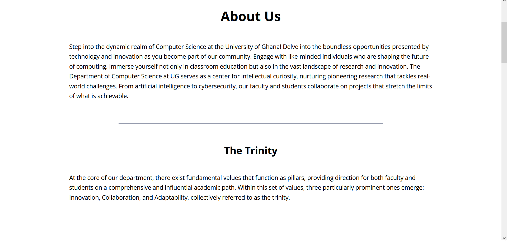
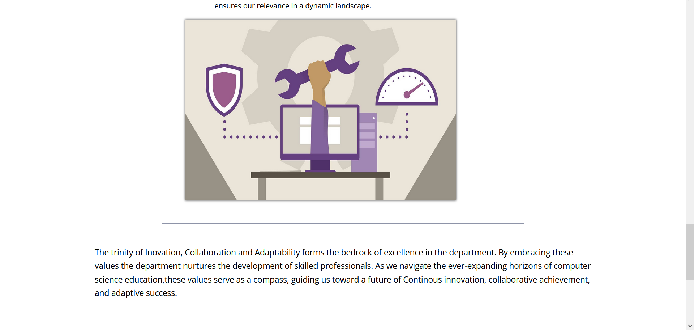
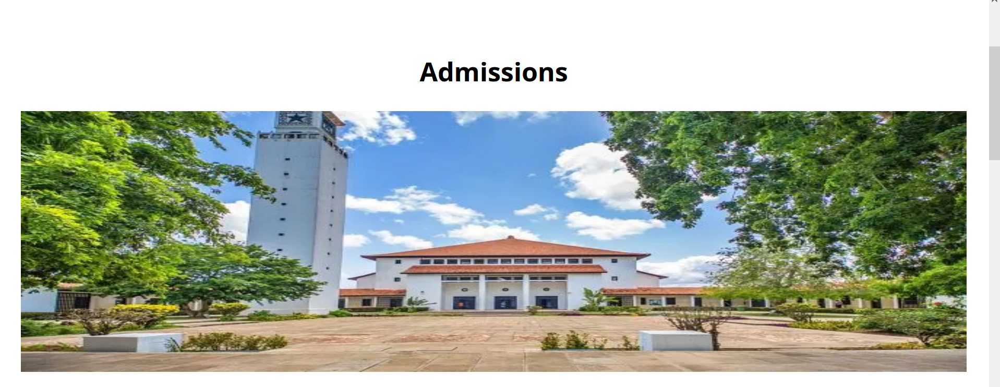
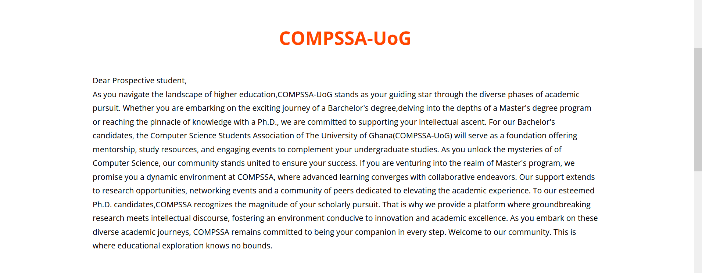

# DCIT_205_IA
## Computer Science Department Website-Readme

Welcome to the official README documentation for  my project on the Computer Science Department Website at the University of Ghana, Legon. This document is designed to offer a thorough guide on project setup, comprehension, and contribution. Whether you are a seasoned developer, potential contributor, or an individual with an interest in technical intricacies, this README serves as the primary resource for your inquiries.

## About the Author: 
Name: Osei Frank Adams
Student ID: 11254384

## Purpose
The purpose of this website is to serve as a remake of  the University of Ghana Department of Computer Science website.The primary objectives are to cultivate and refine my proficiencies in web development, UI design, and comprehensive Git utilization.The project's focus extends beyond the mere remake of the department's website; it embodies my commitment to mastering the intricacies of contemporary web technologies and version control practices.

## Cloning and Setup Instructions:
**To set up the project locally, follow these steps:**
1. Fork my repo:
Visit [https://github.com/Healer2003/11254384_DCIT_205_IA]

2. Clone the Repository:
Click the code button and copy the url of the forked repo
 Now use the bash script
•  git clone [https://github.com/your-username/11254384_DCIT_205_IA]

3. Change your directory to the forked repo's directory in your IDE terminal:
Use the bash script
cd [forked-repo]

*You're all set! Your main tasks now involve making commits to incorporate changes and pushing* 

## Screenshots
**Homepage**

Introduces user to Computer Science Department

**About**

**Contact Us**

**Academics**

**Research**
Provides information about the research activities of the Computer Science Department

**Faculty**
Introduces the esteemed faculty members of the Department of Computer Science.

**Admission**
Provides information about admission procedures, programs offered, and any other relevant details.

**Events**
Keeps the community informed about upcoming departmental events, conferences, and seminars.

**COMPSSA**
Highlights the activities of the Computer Science Student Association.

## Project Reflection:
During the development of this website, I gained insights into effective web design, database management, and collaborative project development. Overcoming challenges such as styling, working with divs and flexboxes strengthened my problem-solving skills. Looking ahead, I plan to enhance the website by introducing new features to make it more interactive.

*Thank you for viewing my project on the University of Ghana Computer Science Department website. I hope this project enriches your experience.For feedback or issues, please feel free to reach out.*
